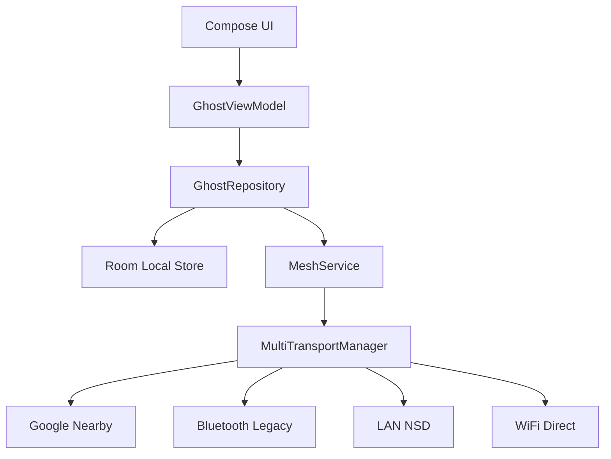

# 👻 ChateX (GhostMesh) - Decentralized Material 3 Mesh

[](https://github.com/Yussefgafer/ChateX/actions/workflows/android.yml)
[](https://opensource.org/licenses/MIT)
[](https://kotlinlang.org)
[](https://m3.material.io)

**ChateX** is a high-performance, professional decentralized mesh networking chat application. Built for the future of private communication, it operates entirely without the internet or central servers.

> "No internet? No problem. The void is always open." 🌌

---

## 🌟 Key Features

### 📡 Simultaneous Multi-Transport Mesh
ChateX uses a Hybrid Mesh architecture that can run multiple connection methods concurrently:
- **Google Nearby Connections:** High-bandwidth P2P clustering.
- **Bluetooth Legacy:** Reliable fallback for all devices.
- **LAN (NSD):** Seamless communication over local WiFi networks via Network Service Discovery.
- **WiFi Direct:** Peer-to-peer connectivity completely independent of Google Play Services.
- **Multi-hop Relay:** Every device acts as a spectral relay, extending network range dynamically.

### 🎨 Material 3 Expressive UI (The Void Aesthetic)
- **God Mode Customization:** Full control over UI parameters (Corner Radius, Font Scaling) and Network tuning (Timeouts, Cache sizes).
- **Professional Radar:** A minimalist, pulsing interface to discover nearby nodes in the void.
- **Dynamic Color:** Full support for Material You dynamic theming across Light and Dark modes.
- **Shared Element Transitions:** Sophisticated, smooth animations optimized for performance.

### 🔐 Spectral Security
- **E2EE Encryption:** AES-256-GCM protected spectral packets via Android Keystore.
- **Hardware-backed ECDH:** Secure peer-to-peer session key exchange.
- **Stealth Mode:** Stay invisible on the radar while still receiving packets from the void.
- **Burn After Reading:** Messages that self-destruct after a preset time.

---

## 🏗️ Architecture



---

## 🛠️ Tech Stack (2026)

- **Language:** Kotlin 2.3.10 (K2 Compiler)
- **UI:** Jetpack Compose (Material 3 Expressive)
- **Persistence:** Room Database (Offline Storage)
- **Networking:** Multi-Transport P2P (NSD, WiFi Direct, Google Nearby, Bluetooth)
- **Security:** ECDH + AES-256-GCM (Hardware-backed)

---

## 🚀 Getting Started

1. **Manifest Identity:** Set up your nickname and spectral color.
2. **Scan the Void:** Open the Radar screen to see nearby ghosts.
3. **God Mode:** Go to Settings to tune your networking and UI to your exact preference.
4. **Relay:** Even when idle, your device helps relay packets, strengthening the mesh.

---

## 🛡️ Security Manifesto

1. **Zero Centralization:** No servers, no logs, no middle-man.
2. **Hardware Encryption:** Keys never leave the device's TEE.
3. **Data Integrity:** Every packet is verified to prevent spoofing.

---

## 📦 Building

### Local Build
```bash
./gradlew assembleDebug
```

### Run Tests
```bash
./gradlew test
```

---
*Created with 💜 and AI by [Jo](https://github.com/Yussefgafer). Inspired by the silence of the void.*
