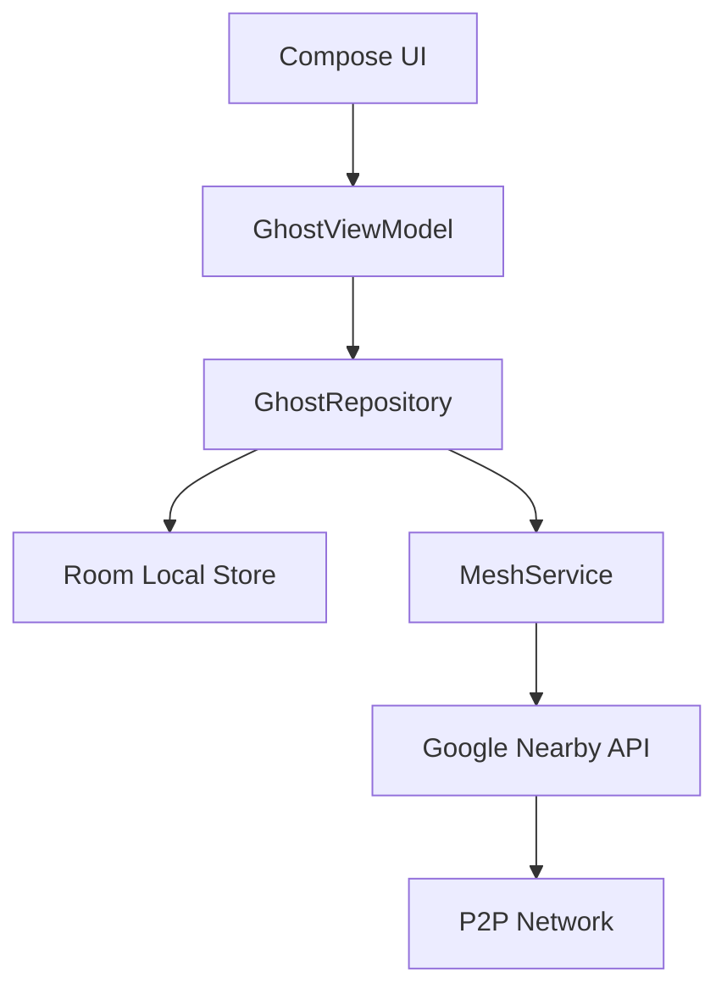

# 👻 ChateX (GhostMesh)

[](https://github.com/Yussefgafer/ChateX/actions/workflows/android.yml)
[](https://opensource.org/licenses/MIT)
[](https://kotlinlang.org)
[](https://m3.material.io)

**ChateX** is a high-performance, decentralised mesh networking chat application built for the future of private communication. 
> "No internet? No problem. The void is always open." 🌌

---

## 🌟 Key Features

### 📡 The Mesh Core
- **Decentralised Mesh:** Communicates directly between devices using **Bluetooth Low Energy** and **WiFi Direct**.
- **Multi-hop Relay:** Every device acts as a spectral relay, extending the network range far beyond a single connection.
- **Stealth Mode:** Stay invisible on the radar while still receiving packets from the void.

### 🔐 Spectral Security
- **E2EE Encryption:** AES-256-GCM protected spectral packets via **Android Keystore**.
- **Burn After Reading:** Messages that self-destruct after a preset time.
- **Offline Queuing:** Packets are held in the local archive and delivered automatically when a ghost reappears.

### 💬 Expressive Messaging
- **Smart Replies:** Reply to specific messages with a fluid visual link.
- **Media Support:** Send encrypted images and voice notes through the mesh.
- **Large File Transfer:** Chunked delivery for files up to **100MB** (32KB spectral chunks).
- **Haptic Feedback:** Tactile interaction with custom intensity for every action.

### 🎨 Material 3 Expressive UI
- **Radar Screen:** Interactive visualization of nearby nodes as floating ghosts.
- **90FPS Fluidity:** Hand-tuned graphics layer using `graphics-shapes` for morphing icons.
- **Wavy Progress:** Visual representation of network vibrations.

---

## 🛠️ Tech Stack (2026)

- **Language:** Kotlin 2.1.0 (K2 Compiler)
- **Framework:** Jetpack Compose (Modern UI)
- **Architecture:** MVVM + Repository Pattern
- **Persistence:** Room Database (Offline Storage)
- **Security:** AES-256 + RSA (Hardware-backed)
- **Networking:** Google Nearby Connections API

---

## 🚀 Getting Started

1. **Manifest Identity:** Set up your nickname and spectral color.
2. **Scan the Void:** Open the Radar screen and wait for nearby ghosts to appear.
3. **Establish Link:** Tap on a ghost to start a private spectral session.
4. **Relay:** Even if you aren't talking, your device helps relay packets for others!

---

## 🏗️ Architecture



---

## 🛡️ Security Manifesto

1. **Zero Centralization:** No servers, no logs, no middle-man.
2. **Hardware Encryption:** Keys never leave the device's TEE (Trusted Execution Environment).
3. **Data Integrity:** Every packet is signed to prevent ghost-in-the-middle attacks.

---

## 📦 Building

### Local Build
```bash
./gradlew assembleDebug
```

### Run Tests
```bash
./gradlew test
```

---
*Created with 💜 and AI by [Jo](https://github.com/Yussefgafer). Inspired by the silence of the void.*

